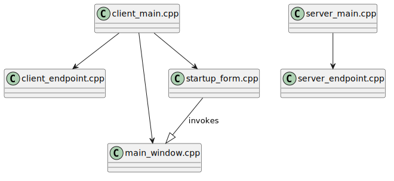

# Cryptic Writings

End-to-End encrypted chat application

## Qt6 dependencies
Client executable has dependency on `Qt::Widgets` module (with dependency on OpenGL or other graphics library), `Qt::Network` and `Qt::Core`.
Server executable only uses `Qt::Network` and `Qt::Core` and can be built on a remote SSH server.

### Client side requirements:
```bash
sudo apt update
sudo apt install qt6-base-dev libqt6widgets6
```

### Server side requirements:
```bash
sudo apt update
sudo apt install qt6-base-dev
```

## Build

To build both client and server executables run:
```bash
./build.sh
```

To build server executable only:
```bash
./build.sh server
```

## Run
```bash
./bin/crywri-server     # server side
./bin/crywri-client     # client side (gui)
```

## Object relationship


