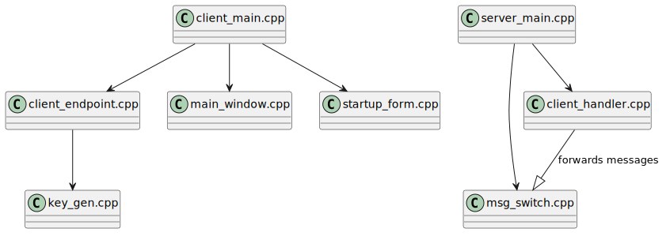

# Cryptic Writings

End-to-End encrypted chat application

## Build

To build both client (has dependency on Qt6) and server executables:
```bash
./build.sh
```

To build server executable only:
```bash
./build.sh server
```

## Run
```bash
./bin/crywri-server     # server side
./bin/crywri-client     # client side (gui)
```

## Design


