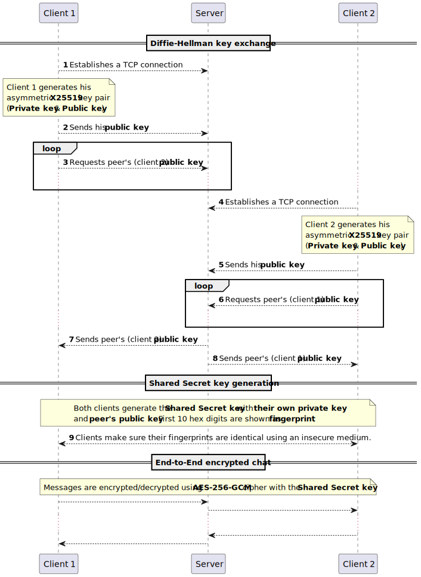

# Cryptic Writings

End-to-End encrypted chat application

### Client side requirements:
```bash
sudo apt update
sudo apt install qt6-base-dev libqt6widgets6 libssl-dev
```

### Server side requirements:
```bash
sudo apt update
sudo apt install qt6-base-dev
```

## Build

To build both client and server executables:
```bash
mkdir build && cd build
cmake ../ && make -j4
```

To build server executable only:
```bash
mkdir build && cd build
cmake ../ -DSERVER_ONLY=ON && make -j4
```

To use local Qt installation:
```bash
mkdir build && cd build
cmake ../ -DCMAKE_PREFIX_PATH=~/path/to/Qt && make -j4
```

## Run

```bash
./bin/crywri-server     # server side
./bin/crywri-client     # client side (gui)
```

## Sequence diagram



## Object relationship


